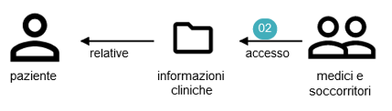
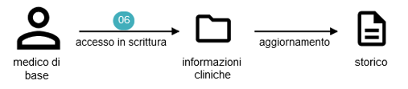
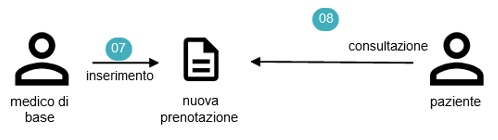

# Analisi
L'analisi del dominio è stata una parte fondamentale nel ciclo di vita del progetto.
L'obiettivo principale del sistema era quello di soddisfare in modo preciso i requisiti voluti dall'utente.
L'analisi effettuata è dettagliata, ed ottenuta seguendo i principi del *Domain-Driven Design* o *DDD* (Evans 2004).

Questa fase ha visto l'avvicendarsi di vari processi che ci hanno permesso di sviluppare una profonda conoscenza del dominio applicativo. 
Di seguito saranno esposte più approfonditamente le varie fasi dell'analisi del dominio e gli elementi individuati con esse.

## Descrizione del dominio
Un gruppo di ricerca che si occupa di studi in ambito informatico-sanitario ci ha contattato per la creazione di un sistema che consenta a medici, infermieri e a tutto lo staff medico di accedere in maniera più agevole a tutte le informazioni del paziente in particolare riuscendo ad ottenere, in modo semplice ed automatico, eventuali allarmi futuri.
Durante la prima fase abbiamo incontrato il referente del gruppo di ricerca, Matteo Scucchia il quale ci ha descritto il sistema richiesto: 

"Faccio parte del gruppo di ricerca europeo in ambito informatico-sanitario. 
Come gruppo di ricerca ci occupiamo di studiare l'evoluzione dei pazienti all'interno del sistema ospedaliero nazionale e del processo che lo staff medico deve effettuare per poter accedere alle informazioni degli stessi.
Si è notato come, sempre più frequentemente, i pazienti siano richiamati a rispondere a medesime domande da parte di diversi medici, sulla base del reparto in cui si trovano e, al tempo stesso, lo staff medico è chiamato ad inserire informazioni replicate all'interno del proprio sistema di gestione.
Chiaramente anche le variazioni minimali sullo stato medico del paziente, influiscono sull'aggiornamento del suo stato di salute. Spesso l'organizzazione di un ospedale è semi-autonoma a livello di dipartimento ed i servizi non sono coordinati in termini di pianificazione.

Basta pensare che già nel 2007 gli ospedali spendevano il 25\% del budget in tecnologia IT e la incanalava soprattutto nelle fasi di registrazione, creazione di record sanitari, aggiornamento e procedure medico-chirurgiche.
Grazie a questi investimenti si sarebbe potuto facilitare non solo il processo di informazioni ma anche la velocità stessa delle cure mediche, oggi, si continuano a perdere ore per concludere visite, consulti medici o prescrizioni. 
Questo accade poiché, nonostante la grande varietà di tecnologie presenti all'interno del sistema ospedaliero, le architetture sono separate; servirebbe un unico sistema. 

A seguito di ciò, avremmo bisogno di un sistema che permetta di limitare le procedure che lo staff medico è costretto a mettere in pratica quotidianamente, con conseguente riduzione delle informazioni richieste al paziente, e che permetta di ottenere valutazioni sullo stato di salute di questi ultimi. .

I pazienti possiedono diverse caratteristiche fisiche e comportamentali che dipendono dal loro stato di salute attuale. 
Oggi la gestione e il controllo della salute sono basati sull’uso, la trasmissione e il confronto di una grande quantità di dati, informazioni e conoscenze eterogenee. 
Le informazioni che vengono mappate oggi nei sistemi sanitari regionali o statali sono prevalentemente suddivise in *cartelle cliniche elettroniche o cartacee* e *fascicoli sanitari elettronici*. 
A questo proposito occorre ripensare sia i metodi usati finora per memorizzare e organizzare l’informazione clinica, che le procedure per scambiare e mettere in comune i dati tra operatori sanitari. 

Uno degli obiettivi richiesti perciò è quello di migrare ad una cartella clinica elettronica pienamente inserita nel sistema informativo sanitario con un conseguente trattamento uniforme dei dati clinici e amministrativi.
Un ulteriore obiettivo che ci poniamo è quello di fornire ai metodi metodologie automatiche per poter fornire ai medici informazioni o avvisi, in modo preventivo, di possibili malattie, soprattutto cardiache ottenute verificando lo stato clinico di un paziente. 
Questo permetterebbe allo staff medico non solo di aumentare l'efficacia rispetto agli esiti di salute forniti ma anche di poter essere a conoscenza di una possibile malattia in modo quasi istantaneo.
Ci sono quindi molte informazioni rilevanti al fine della nostra ricerca, che si esprimono in diverse caratteristiche.

Per poter monitorare tutti questi parametri sarà necessario capire com'è l'ambiente in cui si trovano i pazienti, e come avvengono i passaggi all'interno dell'ambiente stesso."

Chi farà uso dell'applicazione potrà quindi:

   1. In qualità di figure professionali:
        - Accedere alle informazioni del paziente;
        - Aggiornare eventuali informazioni sullo stato di salute, in tempo reale;
        - Ottenere avvisi per eventuali malattie future;
        - Alleggerire il proprio carico di lavoro per quanto riguarda la "conoscenza" iniziale delle informazioni del paziente.
   2. In quanto paziente:
        - Accedere alle proprie informazioni;
        - Essere sempre aggiornato sul suo stato di salute.

Prima di addentrarci nella specifica dei requisiti facciamo chiarezza sui vocaboli utilizzati:

| Vocaboli                        | Definizioni                                                                                                                                                                                                                                                                                                                                                                                                                                                                                  |
|---------------------------------|----------------------------------------------------------------------------------------------------------------------------------------------------------------------------------------------------------------------------------------------------------------------------------------------------------------------------------------------------------------------------------------------------------------------------------------------------------------------------------------------|
| Paziente                        | Un paziente, in medicina, è una persona che si rivolge ad un medico <o ad una struttura di assistenza sanitaria per accertamenti o problemi di salute.                                                                                                                                                                                                                                                                                                                                    |
| Sistema ospedaliero nazionale   | Il Servizio sanitario nazionale (SSN) è un sistema di strutture e servizi che hanno lo scopo di garantire a tutti i cittadini, in condizioni di uguaglianza, l'accesso all'erogazione delle prestazioni sanitarie.                                                                                                                                                                                                                                                                    |
| Sistema di gestione             | Un sistema di gestione è un insieme di procedure, di sistemi informativi e di sistemi informatici dedicati tipicamente a processi operativi o amministrativi.                                                                                                                                                                                                                                                                                                                             |
| Cartella clinica                | La cartella clinica è il documento principale in un processo di assistenza e presa in carico di un paziente.  Essa accompagna sempre l'utente in tutte le fasi assistenziali che lo riguardano. Contiene i dati clinici di un assistito, dati che vengono raccolti durante gli incontri con gli operatori sanitari, per la prevenzione o in occasione di episodi di malattia. Solitamente viene chiamata Electronic Patient Record (EPR) o anche Electronic Medical Record (EMR). |
| Fascicolo sanitario elettronico | Il fascicolo sanitario elettronico è una raccolta online di dati e informazioni sanitarie che costituiscono la storia clinica e di salute del paziente ed è alimentato dai soggetti che prendono in cura il paziente nell'ambito del Servizio Sanitario Regionale.  Questo viene denominato Electronic Healt Record (EHR) o fascicolo sanitario elettronico (FSE).                                                                                                                      |
| Operatori sanitari              | Gli operatori sanitari sono tutte le figure professionali che operano in ambito medico sia internamente sia esternamente all'ospedale.                                                                                                                                                                                                                                                                                                                                                    |
| Esiti di salute                 | Con il termine esiti di salute si intende tipicamente una risposta ottenuta da un intervento.                                                                                                                                                                                                                                                                                                                                                                                                 |
| Ambiente                        | Luogo in cui i pazienti vengono presi in cura (clinica pubblica o privata).                                                                                                                                                                                                                                                                                                                                                                                                                  |
 
A seguito di una prima interazione con il committente Scucchia, cerchiamo di comprendere in modo più approfondito quelle che sono le richieste da parte delle figure professionali che prenderanno parte al sistema. 
Qui verranno presentate le *user stories* ottenute a seguito di un'intervista con ogni componente dello staff medico.

##### Paziente
*UserStory[1]*: In qualità di paziente devo poter accedere in lettura alle mie informazioni cliniche generali come ad esempio allergie, gruppo sanguigno ed al mio passato clinico in modo che mi risulti più semplice il monitoraggio del mio stato di salute.

*UserStory[2]*: In qualità di paziente, per sentirmi più sicuro in ogni evenienza, vorrei che medici e soccorritori potessero accedere alle mie informazioni per potermi somministrare prontamente farmaci e terapie corrette. 

    
*UserStory[3]*: In qualità di paziente, vorrei che i medici che mi hanno in cura aggiornassero le mie informazioni, in modo da poter evitare procedure burocratiche troppo lente e ripetitive.

##### Medico di Base
*UserStory[4]*: In qualità di medico di base vorrei poter accedere in lettura alle informazioni dei miei pazienti, per verificare le cure effettuate e i farmaci già somministrati in modo da provare terapie nuove o mirate nel caso di persistenza della sintomatologia.

*UserStory[5]*: In qualità di medico di base vorrei poter inserire una nuova prescrizione farmaceutica, visualizzabile dal paziente in tempo reale, per acquistare prontamente il prodotto, evitando il ritiro di ricette in loco.

*UserStory[6]*: In qualità di medico di base vorrei poter accedere in scrittura alle informazioni dei pazienti che ho in cura in modo da aggiornare in tempo reale il loro storico evitando documenti cartacei.

*UserStory[7]*: In qualità di medico di base vorrei poter inserire una nuova prenotazione, visualizzabile dal paziente in tempo reale.

##### Soccorritore
*UserStory[8]*: In qualità di soccorritore vorrei poter riconoscere i pazienti e accedere in lettura alle loro informazioni, in modo da poter somministrare prontamente farmaci nel caso questi siano privi di sensi.  

##### Infermiere
*UserStory[9]*: In qualità di infermiere, devo poter accedere in scrittura ai dati del paziente al fine di gestire il ricovero dei pazienti in reparto, svolgendo delle pratiche identificative, che andranno poi tutte aggiunte all’interno della cartella clinica.

*UserStory[10]*: In qualità di infermiere voglio poter indicare e memorizzare lo storico delle azioni svolte dal/sul paziente durante il ricovero (Diario clinico → somministrazione di pasti, minzione e defecazione post-anestesia, somministrazioni di farmaci, aggiornamento dello stato del paziente, medicazioni varie, etc).

*UserStory[11]*: In qualità di infermiere devo poter accedere in scrittura alle informazioni del paziente per poter inserire le pratiche di dimissione del soggetto ricoverato, con annessa gestione dei documenti per il consenso e/o successive visite.

*UserStory[12]*: In qualità di infermiere, voglio poter accedere in lettura al diario clinico del paziente aggiornato al momento attuale.

##### Chirurgo
*UserStory[13]*: In qualità di chirurgo devo poter accedere in lettura alle informazioni del paziente al fine di conoscerne lo storico per capire come affrontare l’operazione.

*UserStory[14]*: In qualità di chirurgo devo poter accedere in scrittura alla cartella clinica in modo da aggiornare il diario clinico al fine di poter aggiungere eventuali somministrazioni dovute a complicanze operatorie. 

*UserStory[15]*: In qualità di chirurgo devo poter accedere in scrittura alle informazioni del paziente per poter inserire una nuova cartella clinica.

*UserStory[16]*: In qualità di chirurgo devo poter accedere in scrittura alle informazioni del paziente al fine di poter chiudere la cartella clinica. Una volta chiusa, la cartella clinica non è più modificabile.

##### Cardiologo
*UserStory[17]*: In qualità di cardiologo devo poter accedere in scrittura alle informazioni del paziente al fine di inserire un referto di una visita cardiologica.

Le interviste con le varie figure professionali ci hanno consentito di ottenere un quadro più ampio e dettagliato del sistema richiesto dal committente. 
Rispecchiando le situazioni in cui le varie figure del dominio si trovano ad interagire con l'applicazione stessa possiamo identificare i casi d'uso.
Nel seguito vengono riportati i diagrammi dei casi d'uso, con riferimento alle user stories elencate precedentemente.

In figura è presente il diagramma UML dei casi d'uso relativo al paziente.

Nelle figure seguenti sono presenti i diagrammi UML dei casi d'uso relativi a tutte le figure professionali che possono interagire con il sistema.
Il contesto indicato dal diagramma è l'intero sistema con possibilità di accesso, per le seguenti figure, sia in lettura sia in scrittura.

Una delle fasi fondamentali dell'intero processo di analisi, è ricaduta sulla definizione dei requisiti che il progetto dovrà soddisfare.
Questi verranno raffinati in corso d'opera andando a creare una comprensione del dominio sempre più approfondita, come previsto dalla metodologia DDD.

#### Requisiti funzionali
I requisiti funzionali riguardano le funzionalità fornite dal nostro sistema e sono estrapolati a partire dalle user-stories.
 - un paziente deve poter accedere in lettura allo storico dei propri dati
 - un medico di base deve poter accedere in lettura allo storico dei propri pazienti e deve poter aggiornare le informazioni inerenti al medico di base
 - un infermiere e un medico specializzato devono poter visualizzare le cartelle cliniche a cui hanno contribuito e le informazioni generali del paziente che stanno trattando. Devono essere in grado di aprire, modificare e chiudere una cartella clinica
 - un soccorritore deve poter accedere alle informazioni generali del paziente che sta soccorrendo per la somministrazione di medicinali che saranno poi inseriti nella cartella clinica  - un cardiologo deve poter inserire una visita cardiologica effettuata al paziente
 - un amministratore di sistema deve poter inserire e aggiornare tutte le figure del sistema
 - è previsto un login per ciascuna figura, la quale potrà accedere in lettura e scrittura solo ed esclusivamente ai dati per i quali è preposta
 - il sistema deve essere in grado di effettuare previsioni di almeno un evento futuro, come ad esempio una malattia

#### Requisiti non funzionali
I requisiti non funzionali sono:
 - il codice dovrà essere facilmente espandibile, al fine di poter aggiungere nuove entità e funzionalità al sistema, anche in un ottica di progetto di tesi
 - progettazione del sistema attraverso il Domain Driven Design
 - sviluppo del sistema di Build Automation del progetto
 - creazione di pipeline di Continuos Integration 

La metologia DDD prevede, una volta ottenuta una buona conoscenza del dominio applicativo, la necessità di definire l'ubiquitous language.
L'*Ubiquitous language* o UL è l’output prodotto dalla fase di *Knowledge Crunching* e l’artefatto generato dalla comprensione condivisa del dominio.
L'UL è un linguaggio esplicito usato per la descrizione del modello del dominio e del problem domain; viene utilizzato anche nell'implementazione del codice sorgente. 
L’UL contiene terminologie specifiche del business e, con il tempo viene raffinato e migliorato, di conseguenza la code implementation riflette questo cambiamento.
Questo avviene perché il knowledge crunching è un processo in corso, ovvero che non si svolge solo all’inizio ma, durante l’intero ciclo di vita del progetto, in modo da rendere anche il modello malleabile a cambiamenti continui e futuri.

Per visualizzare quali dati sono stati modellati è possibile fare riferimento all'immagine disponibile [*qui*](https://miro.com/app/board/o9J_lUG3kJQ=/).