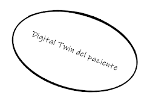
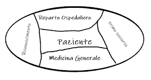
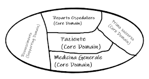
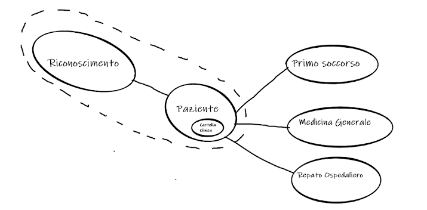

# Design architetturale
Visti i requisiti definiti nell'[Analisi](Analisi.md), il gruppo ha effettuato un attento studio su come modellare il sistema, in modo da effettuare successivamente una corretta progettazione dei concetti specifici del dominio.
La scelta dell'architettura del sistema ha tenuto conto anche delle proposte fornite dalla filosofia Domain Driven Design, la quale mette a disposizione vari modelli per quanto concerne l'architettura generale del sistema, sotto il nome di **strategical patterns**.
Proprio fra queste architetture consigliate, abbiamo identificato la struttura che più si addiceva al nostro dominio, ovvero la *microservice architecture*.
La scelta di realizzare questa prima parte come applicazione distribuita basata su microservizi è stata dettata principalmente dall’interoperabilità e dalla scalabilità che questa soluzione porta con sé. La

## Microservizi e Bounded Contexts
La struttura del sistema a microservizi si appoggia sulla suddivisione del dominio nei rispettivi bounded contexts.

### Bounded Contexts 
Di seguito è riportato il percorso di raffinamento della context map durante durante il ciclo di sviluppo.

## Prima versione dei bounded contexts

## Seconda versione dei bounded contexts

## Terza versione dei bounded contexts

## Quarta versione dei bounded contexts

### Microservizi 
I bounded contexts identificati, durante la fase di analisi del dominio, hanno rivelato i seguenti contesti nel dominio:
- Paziente
- Riconoscimento
- Primo soccorso
- Medicina Generale
- Reparto Ospedaliero.

Ogni concetto elencato verrà sviluppato come un singolo microservizio, in modo tale da disporre di un proprio flusso di lavoro e di REST API per la comunicazione.

L'unico dettaglio degno di nota riguarda il context del riconoscimento e quello del paziente, che come mostrato nella contexts map, sono progettati come un unico microservizio, che raggruppa i due concetti.